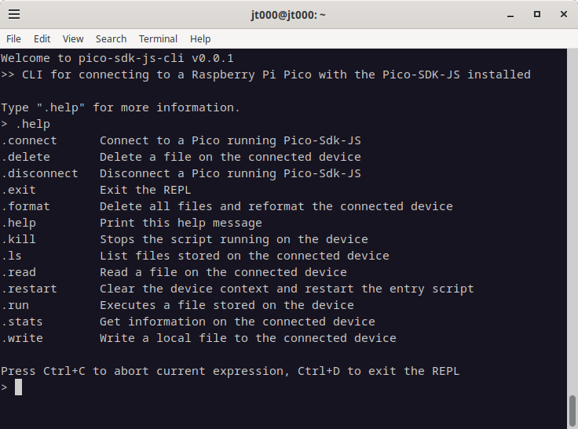

# pico-sdk-js-cli

REPL\CLI for connecting to a Raspberry Pi Pico or Pico-W installed with the [Pico-SDK-JS](https://github.com/jt000/pico-sdk-js).




## Installation

Install pico-sdk-js-cli globally with npm

```bash
  npm install -g pico-sdk-js-cli
```

Note that this CLI expects a [Raspberry Pi Pico-series Microcontroller](https://www.raspberrypi.com/documentation/microcontrollers/pico-series.html) with the [pico-sdk-js](https://github.com/jt000/pico-sdk-js/) installed. For installation instructions, see [pico-sdk-js readme](https://github.com/jt000/pico-sdk-js?tab=readme-ov-file#pico-sdk-js).

## Getting Started & Examples

To get started quickly using the pico-sdk-js, try out [our examples](https://github.com/jt000/pico-sdk-js-examples/tree/main?tab=readme-ov-file#readme).

## Startup

Start up the pico-sdk-js REPL by simply running

```bash
psj
```

Use the `--help` arguement to show the various command line options.

### Options

**--help** | Show the command line options help

**--log-level <level>** | Adjust the log level that is output from the REPL. Valid options are "trace", "debug", "warning", or "error" (default). (alias "--ll")

**--auto-connect** | Automatically connect to device on /dev/ttyACM0. (alias "--ac")

## REPL Commands

Once started, you will be in a repl for communicating with a pico-sdk-js.

### .help

View the help documentation for all the REPL commands.

### .exit

Exit the REPL disconnecting from any connected devices and closing the `psj` cli.

### .connect

Connect to an attached Raspberry Pi Pico via USB with [pico-sdk-js](https://github.com/jt000/pico-sdk-js?tab=readme-ov-file#pico-sdk-js) installed.

**Usage:** `.connect [--device <devicename>]`

**Example:** `.connect --device /dev/ttyACM0`

`--device <devicename>`

* The device identifier to connect to. 
* Optional. By default `.connect` will attempt to connect to `/dev/ttyACM0`

### .disconnect

Disconnects from a connected Raspberry Pi Pico previously connected via [`.connect`](#connect).

**Usage:** `.disconnect` (there are no arguments on this command)

### .stats

Display statistics from a connected Raspberry Pi Pico.

**Usage:** `.stats` (there are no arguments on this command)

```bash
> .stats
   name            :  pico-sdk-js
   version         :  0.0.1
   running         :  main.js
   total ram       :  66036
   used ram        :  2468
   available ram   :  63568
   js engine       :  JerryScript
   js version      :  1
   js bytes        :  9880
   js peak bytes   :  11512
   js size         :  184312
```

### .run

Execute a remote javascript file stored on the Raspberry Pi Pico previously saved using [`.write`](#write).

**Usage:** `.run <remote-path>`

`remote-path`

* The name of the javascript to load from the Pico device
* Required.

### .kill

Stops a running javascript file on the Pico device

**Usage:** `.kill` (there are no arguments on this command)

### .ls

Lists all remote files stored on the Pico device

**Usage:** `.ls` (there are no arguments on this command)

```bash
> .ls
total 3 file(s)
┌─────────┬────────────┬──────┐
│ (index) │    name    │ size │
├─────────┼────────────┼──────┤
│    0    │ 'main.js'  │ 446  │
│    1    │ 'noop.js'  │  68  │
│    2    │ 'test.txt' │  12  │
└─────────┴────────────┴──────┘
```

### .read

Reads a remote file stored on the Pico device and either prints to the screen or saves to a local file.

**Usage:** `.read <remote-path> [--local-path <path> [--overwrite]]`

**Example 1:** `.read file.js --local-path ./myFile.js` Read from the Pico with the file name "file.js" and save the local "myFile.js" if it does not already exist.

**Example 2:** `.read file.js` Read the remote `file.js` and output the contents to the screen.

`remote-path`

* The name of the file to read from the Pico device
* Required.

`--local-path <path>`

* The name of the local file to save the file to.
* Optional. If this parameter is omitted, then the file contents will be outputed to the console.

`--overwrite`

* When `--local-path` is provided, this argument will allow the output file to clobber an existing file with the same file name.
* Optional. If this parameter is omitted, then an existing file will cause an error and prevent being overwritten.

### .write

Writes to a remote file store on the connected Pico device.

**Usage:** `.write <remote-path> [--local-path <path>] [--content <text>]

**Example 1:** `.write file.js --local-path ./myFile.js` Write the local "myFile.js" to the Pico with the file name "file.js".

**Example 2:** `.write file.js` Write the local "file.js" to the Pico with the file name "file.js".

**Example 3:** `.write hi.txt --content "Hello, World!"` Write the string "Hello, World!" to the Pico with the file name "hi.txt".

`remote-path`

* The name of the file to write to the Pico device
* Required.

`--local-path <path>`

* The name of the local file to write.
* Optional. If this parameter is omitted, then `remote-path` file will be used to look in the same directory.

`--content <text>`

* A string content to write to the `remote-path` file.
* Optional. Cannot be used in conjunction with `--local-path`


### .delete

Deletes a remote file stored on the connected Pico device.

**Usage:** `.delete <remote-path>`

**Example:** `.delete file.js` Deletes the remote file on a connected Pico device named "file.js"

`remote-path`

* The name of the file to delete on the Pico device
* Required.

### .format

Deletes all files and reformats the connected Pico device's file system stored on a portion of the FLASH.

**Usage:** `.format --confirm`

`--confirm`

* Provides confirmation that all content on the connected Pico device will be deleted
* Required.

## Support

For support, please [file a issue on our github page by clicking this link](https://github.com/jt000/pico-sdk-js-cli/issues/new?template=bug_report.md).


## License

[GPL-3.0](https://github.com/jt000/pico-sdk-js-cli?tab=GPL-3.0-1-ov-file#readme)

